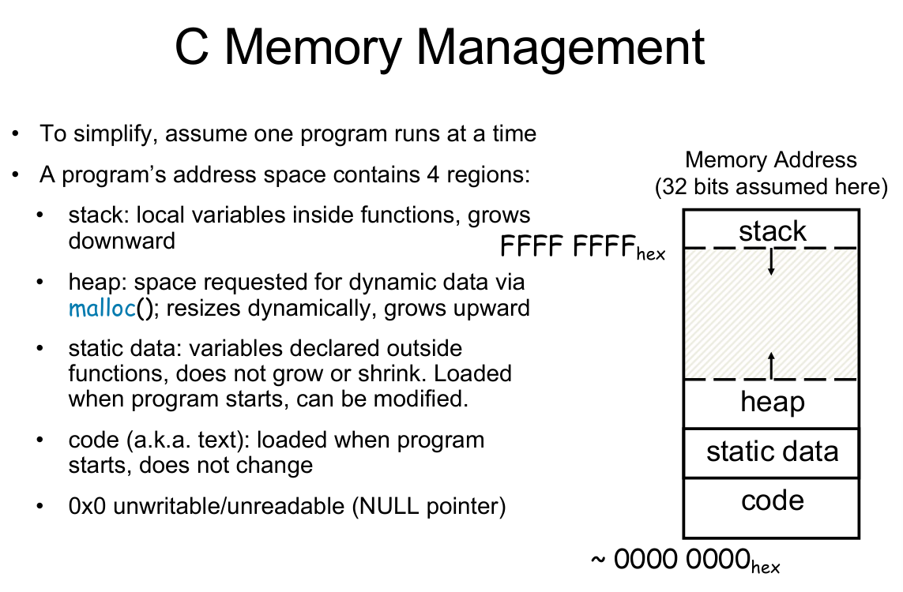

# How C programs work
## Compilation

### C and Other Languages

| 语言 | 转换目标 | 执行方式 | 核心特点 |
| :--- | :--- | :--- | :--- |
| **C语言** | **机器码 (Machine Code)** | **编译执行** | 运行前就已完全翻译为机器指令，执行速度最快，不跨平台。 |
| **Java** | **字节码 (Bytecode)** | **混合执行** | 先编译为与架构无关的字节码，运行时由JVM（虚拟机）再翻译为机器码。**一次编写，到处运行**。 |
| **Python** | **无中间码** | **解释执行** | 运行时逐行读取源码并翻译执行，无需提前编译，灵活性高但速度最慢。 |

### First Procedure - CPP
概括来说，整个CPP过程如下：
1. 注释清除
2. 指令识别
3. 文件包含
要说明的是，在文件开头的`#`指令都是直接作用于预编译的文件，比如`#include <stdio.h>`,`#define BABA 15.32`(语法是 `#define 宏名(参数1，参数2) 替换文本`)

一个比较tricky的问题：
```c
#define square(x) ((x) * (x))
square(i++)
```

`i++` 的含义是：**先取 i 的旧值参与运算，然后 i 自增 1**。

所以 `((i++) * (i++))` 的直观效果像这样：

- 第一次 `i++`：取出旧值 `i_old1`，然后 `i = i + 1`
- 第二次 `i++`：再取出此时的旧值 `i_old2`，然后 `i = i + 1`
- 两个旧值相乘：`i_old1 * i_old2`

举个例子，假设开始 `i = 3`：

- 第一个 `i++` 取值 3，之后 `i` 变 4
- 第二个 `i++` 取值 4，之后 `i` 变 5
- 乘积是 `3 * 4 = 12`

所以你可能会以为平方是 9，但宏会变成 12，而且 `i` 还从 3 变成 5（自增两次）。
### Parser & Semantic Analysis
1. 词法分析(Lexer)：将源代码转换成单词流——Token化，并且记录每一个Token在源文件中的精确位置
2. 语法分析(Parser)同时进行Semantic Analysis核心产物是AST


### Important Operations: Link
假设这个地方我存在一个文件：`main.c`和一个文件`utils.c`,以及一个头文件`utils.h`，这些文件的内容如下：
```c
//main.c
#include <stdio.h>
#include "utils.h"
int main() {
    int result = add(2, 3);
    printf("Result: %d\n", result);
    return 0;
}
```
```c
//utils.c
#include "utils.h"
int add(int a, int b) {
    return a + b;
}
```
```c
//utils.h
#ifndef UTILS_H
#define UTILS_H
int add(int a, int b);
#endif
```
那么现在我应该要怎么编译呢？
```bash
gcc -c main.c -o main.o
gcc -c utils.c -o utils.o
gcc main.o utils.o -o my_program
```
那么这个最后一个步骤就是Link的过程，将所有的目标文件传递给编译器得到最终的可执行的文件(`.exe`,`.out`)

具体而言，我们重新看一下这个过程：在我们输入`gcc -c main.c -o main.o`的时候发生了什么？

在`main.c`中我们引入了`stdio.h`（`#include <utils.h>`），那么这个头文件会被包含进来。但是在这个地方我们在这个`utils.h`中没有定义具体的函数的实现，只是声明了这个函数，通过`#include <utils.h>`这个指令会将这个`utils.h`的编译的结果整体包含进入这个文件中，所以这个文件很清楚我们声明了这个函数，但是不清楚这个函数的具体的实现过程

那么在这个`utils.c`中，我们就详细描述了这个函数的具体实现过程

所以在最后的`gcc main.o utils.o -o my_program`过程中，我们将两个编译的结果链接在一起，得到最终的可执行文件。

当然我们会存在疑问，为什么不直接将这个函数的实现直接写在这个`utils.c`文件中呢？

这会导致很严重的问题！如果在`utils.h`中我们尝试实现这个函数，那么如果存在多个文件同时调用这个`utils.h`文件就会导致一个函数被**重复定义（除非是`static`function）**（注意不是重复声明）这将会导致编译器报错。

那么这个时候又会存在疑问，既然可以重复声明函数，为什么需要在`<utils.h>`中添加这个头文件保护宏呢？
```c
#ifndef UTILS_H
#define UTILS_H
#endif
```
头文件保护宏（`#ifndef`/`#define`/`#endif`）不是为了解决 “多文件重复声明”，而是为了解决 “单个`.c` 文件内重复包含同一个`.h` 导致的重复声明结构体等内容 / 编译错误（结构体不允许重复定义）”

### `enum`&`const`&`#define`
- `enum`
```c
// 枚举定义（仅仅表示的是一种数值和变量的映射规则，不会占用内存）
enum color { black, red }; 

// 枚举变量（真正占用内存的是这个变量）
enum color c = black; //int size = 4 byte

enum {A}; //匿名枚举，A等价于0
```

| 特性 | `const` 常量 | `enum` 枚举 | `#define` 宏 |
| :--- | :--- | :--- | :--- |
| **类型** | 有明确类型（如 `int`/`float`） | 底层为 `int`，有枚举类型约束 | 无类型，纯文本替换 |
| **内存** | 占用对应类型内存（可优化为立即数） | 不占内存，编译时替换为整数 | 不占内存，文本替换 |
| **作用域** | 遵循 C 变量作用域规则 | 遵循标识符作用域规则 | 预处理器全局替换 |
| **适用场景** | 单个带类型的只读值 | 一组相关的整数常量 | 简单文本替换（不推荐） |

**速率比较：**

`#define A 0`,`const int A = 0`,`enum {A}`？

一般我们认为这个地方`#define`,和`enum {A}`的性能要更优于`const int A = 0`，因为这两个在CPP或者是在parsig的过程中就会被映射处理掉。

## Memory
### Pointer
在计算机中，memory的储存类似于一块大型的数组，memory的储存按byte进行，每一个字节都存在自己的地址`address`以及在每一个字节中都存有一个值`value`

我们在声明一个指针的同时需要声明它的类型，这将会确定计算机怎么读取这个内存地址，更重要的是你需要在声明的时候为它配置初始化内存地址，否则会造成严重的内存泄露问题

指针的类型可以相互转化，比如说一个`int *`类型的指针可以转换成`char *`的指针用`(char *)p`这种指令。`void *`指针可以转化成为任意类型的指针，但是`void*`指针**不能够解引用**

#### Pointer and Sturcter
```c
typedef struct {
    int x;
    int y;
} Point;

Point p1={1,2};
Point p2;
Point *paddr;
paddr = &p1;

/* dot notation */
int h = p1.x;
p2.y = p1.y;
/* arrow notation */
int h = paddr->x; 
int h = (*paddr).x; // have the same effect as the above

/* This works too */
p2 = p1

```
#### Pointer and Array
我们经常将`array`当成指针进行使用，但是要注意的是，指针很多时候不能够当成`array`使用。

比如说`char string1[] = "abc"`和`char *string2 = "abc"`虽然这两种方式表示的都是相同的字符串（注意两者都存在这个`\0`在末尾）但是这个`char string1[] = "abc"`可以被修改，但是`char *string2 = "abc"`不可以被修改

```c
int arr[] = { 3, 5, 6, 7, 9 };  //数组
int *p = arr; //这是一个int的指针
int (*p1)[5] = &arr;  // 这是一个指向int arr[5]的指针
int *p2[5]; // int * 的指针的数组
int (*p)(void); //这是一个传入void 返回 int 的函数 的指针
int (*func_arr[5])(float x); // 这是一个int func(float x)的函数指针的数组，大小是5
```

#### Pointer algorithm
为了提高CPU的访问效率，数据类型必须储存在能够整除的地址上。
```c
int arr[] = { 3, 5, 6, 7, 9 };
int *p = arr;
int (*p1)[5] = &arr;

// Are arr+1, p+1, p1+1 the same?
```
1. `arr+1`和`p+1`是相同的，但是`p1+1`和`arr+1`是不同的
2. `p1+1`表示的是地址往后偏移`sizeof(arr)`的地址
**但是**如果这个时候我们将`p1`传入到一个函数中，这个时候`p1`也会退化成为一个指针，这个时候如果再对它进行`p1+1`的处理的时候，还是只会向后面移动`sizeof(void*)`的大小

```c
int i;
int array[10];

for (i = 0; i < 10; i++) {
    array[i] = ...;
}

int *p;
int array[10];

for (p = array; p < &array[10]; p++) {
    *p = ...;
}
```
```c
int(long) strlen(char *s) {
    char *p = s;
    while (*p++)
        ; /* Null body of while */
    return (p - s - 1);
}
```
```c
int ar[10] = {}, *p, *q, sum=0;
p = &ar[0]; 
q = &ar[10];  // ← 合法！这是“one past the end”
while (p != q) {
    sum += *p++;  // 安全：p 在 [0,9] 范围内才解引用
}
```
我们可以获取超过范围的数据地址，但是不能够对超过范围的数据进行解引用

**指针之间的合法的运算**
1. `ptr +/- int`
2. `ptr_1 - ptr_2`(一定要保证两者指针的类型相同且是在同一数组中，返回的是两者之间的元素的个数)
3. `ptr_1 ==/>=/</!= ptr_2`
4. `ptr == NULL`
**要注意的是**
1. 两个指针加法无效
2. 两个指针的乘法无效
3. 整数减去指针无效

#### More C Pointer & Array Dangers
1. C 数组没有越界的检测，如果`int arr [5]`但是如果你访问`arr [100] = 99`不会报错；解决办法，我们需要将这个数组的大小传递给任何操作它的函数
2. 我们虽然创建的是一个数组但是如果传递到一个函数中，数组就会退化成为一个指针，也就是它的尺寸信息会丢失，这个时候你在函数中调用`sizeof(arr)`返回的就是这个指针的大小了


### C memory amanagement

#### Stack
经典的栈行为是这样的：
```text
初始状态: [ Main ] (栈顶)
调用 A:   [ Main ] -> [ A ] (A 压在 Main 上面，栈顶是 A)
A 调用 B: [ Main ] -> [ A ] -> [ B ] (B 压在 A 上面，栈顶是 B)
```
**过程说明**
1. Main 调用 FuncA：栈指针（SP）向下移动，开辟 FuncA 的栈帧（Stack Frame）
2. FuncA 执行完毕，返回 Main：FuncA 运行结束，准备 return。CPU 将栈指针（SP）直接向上移动，指回 Main 的顶部。FuncA 占用的那块内存并没有被“清零”或“擦除”，它只是被标记为无效了。因为 SP 已经不在那里了，所以那块区域现在属于“空闲栈空间”。
3. Main 接着调用 FuncB：Main 调用 FuncB。栈指针（SP）再次向下移动。funcB会复用funcA的栈！

```c
void inc_ptr(int *p) {
    p = p + 1;  // 试图移动指针
}
int *q = A;     // q 指向数组第一个元素 (50)
inc_ptr(q);     // 调用函数
printf("%d", *q); // 输出还是 50，没变！
```
```text
[ main 栈帧 ]
  q = 0x100  (指向 50)

[ inc_ptr 栈帧 ]  <-- 新开辟的空间
  p = 0x100  (是 q 的副本，也指向 50)
```
```c
void inc_ptr(int **h) {
    *h = *h + 1;  // 解引用后修改
}
int *q = A;
inc_ptr(&q);      // 注意这里：传递的是 q 的地址！
printf("%d", *q); // 输出 A[1]，成功了！
```
```text
[ main 栈帧 ]
  q (地址 0x200) = 0x104  (被修改了！现在指向 60)

[ inc_ptr 栈帧 ]
  h = 0x200  (h 只是个工具人，用来定位 q)
```
因此向函数传递指针是合理的，但是将函数的返回指针传递给主函数是危险的

#### Heap
- 分配（malloc）：你可以随时申请一块内存，系统会在仓库里找一块足够大且空闲的地方给你。
- 释放（free）：你可以随时释放任何一块之前申请的内存，不管它是刚申请的，还是很久以前申请的，也不管它在仓库的哪个角落。
- 结果：释放后，那块空间就变回了“空闲”，但它不会自动和旁边的空闲空间合并成一个完美的整体（除非操作系统或内存管理器去做复杂的整理），这会导致 “内存碎片”。
- 后续操作：如果我再 malloc 会怎样？内存管理器的策略：它会遍历空闲链表，寻找第一块能容纳你需要字节的空间。
- 拉伸（realloc）如果原内存块后面没有足够的连续空间来扩容，realloc 不会 强行在原地拉伸（因为会覆盖掉后面的数据），而是会执行一次 “搬家”操作

**常见函数**
| 函数 | 功能 |
|------|------|
| `malloc(size_t n)` | 分配未初始化的 n 字节内存 |
| `calloc(n, size)` | 分配并清零（n × size 字节） |
| `free(p)` | 释放之前分配的内存块 |
| `realloc(p, new_size)` | 调整已有内存块大小（可能移动位置） |

```c
int *ip1 = (int *) malloc(sizeof(int));             // 单个 int
int *ip2 = (int *) malloc(20 * sizeof(int));        // 20 个 int 数组
TreeNode *tp = (TreeNode *) malloc(sizeof(TreeNode)); // 结构体
```

**注意**`free`的对象一定是`malloc`,`realloc`,`calloc`的内存地址，**不能够对进行偏移之后的指针调用`free`**,`free(NULL)`是安全的

```c
int *ip = (int *)malloc(10 * sizeof(int));
// 假设此处 realloc 分配了新地址
realloc(ip, 20 * sizeof(int)); // 错误：返回的新地址被丢弃
// 此时 ip 仍然指向旧地址（但旧地址已经被 realloc 释放了！）
free(ip); // 二次释放，程序崩溃
```
```c
int *ip = (int *)malloc(10 * sizeof(int));
// 用临时指针接收 realloc 返回值
int *new_ip = (int *)realloc(ip, 20 * sizeof(int));

if (new_ip != NULL) { // 必须检查是否分配成功
    ip = new_ip; // 手动将原指针指向新地址
} else {
    // 分配失败：原 ip 仍有效，需手动处理（比如释放）
    free(ip);
    ip = NULL;
}
// 后续操作 ip 就是新地址，最终释放也用 ip
free(ip);
```

`realloc(ip,0) = free(ip)`

**实际过程**
1. 向操作系统申请大内存块：malloc 库不会每次都直接向 OS 申请小块内存，而是先向 OS 申请一整块大的堆空间，作为后续分配的 “内存池”。
2. 分配过程：第一次 malloc 时，从空闲块的起始位置切出所需大小的空间，剩余部分仍作为空闲块留在链表中。
3. 释放与合并：调用 free 时，被释放的内存块会重新链接回空闲链表；如果它和相邻的空闲块相邻，库会自动将它们合并成更大的空闲块，避免内存碎片化。
4. *Buddy 分配器:核心思想：将内存大小总是向上取整为 2 的幂次方（比如申请 5 字节，会分配 8 字节的块）。查找合适大小的空闲块更高效（按 2 的幂分类管理）,释放后与相邻 “伙伴块” 合并也更简单，能快速减少内存碎片。


### Arguments in main()
`int main(int argc, char *argv[])`其中`argc`表示的是命令行参数的总个数，`argv`表示的是命令行参数的数组（`argv[0]`是程序名，`argv[1]`是第一个参数，以此类推）e.g.`clang test.c -o test_program` ; `./test_program arg1 arg2`

