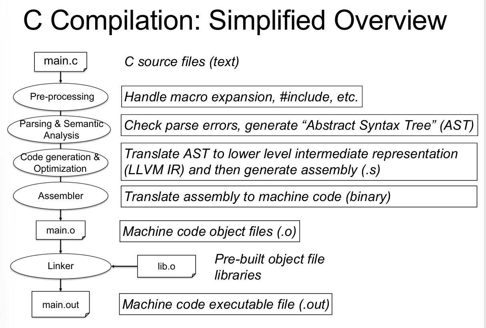

## How C programs work

### C and Other Languages

| 语言 | 转换目标 | 执行方式 | 核心特点 |
| :--- | :--- | :--- | :--- |
| **C语言** | **机器码 (Machine Code)** | **编译执行** | 运行前就已完全翻译为机器指令，执行速度最快，不跨平台。 |
| **Java** | **字节码 (Bytecode)** | **混合执行** | 先编译为与架构无关的字节码，运行时由JVM（虚拟机）再翻译为机器码。**一次编写，到处运行**。 |
| **Python** | **无中间码** | **解释执行** | 运行时逐行读取源码并翻译执行，无需提前编译，灵活性高但速度最慢。 |

### First Procedure - CPP
概括来说，整个CPP过程如下：
1. 注释清除
2. 指令识别
3. 文件包含
要说明的是，在文件开头的`#`指令都是直接作用于预编译的文件，比如`#include <stdio.h>`,`#define BABA 15.32`(语法是 `#define 宏名(参数1，参数2) 替换文本`)

一个比较tricky的问题：
```c
#define square(x) ((x) * (x))
square(i++)
```

`i++` 的含义是：**先取 i 的旧值参与运算，然后 i 自增 1**。

所以 `((i++) * (i++))` 的直观效果像这样：

- 第一次 `i++`：取出旧值 `i_old1`，然后 `i = i + 1`
- 第二次 `i++`：再取出此时的旧值 `i_old2`，然后 `i = i + 1`
- 两个旧值相乘：`i_old1 * i_old2`

举个例子，假设开始 `i = 3`：

- 第一个 `i++` 取值 3，之后 `i` 变 4
- 第二个 `i++` 取值 4，之后 `i` 变 5
- 乘积是 `3 * 4 = 12`

所以你可能会以为平方是 9，但宏会变成 12，而且 `i` 还从 3 变成 5（自增两次）。
### Parser & Semantic Analysis
1. 词法分析(Lexer)：将源代码转换成单词流——Token化，并且记录每一个Token在源文件中的精确位置
2. 语法分析(Parser)同时进行Semantic Analysis核心产物是AST


### Important Operations: Link
假设这个地方我存在一个文件：`main.c`和一个文件`utils.c`,以及一个头文件`utils.h`，这些文件的内容如下：
```c
//main.c
#include <stdio.h>
#include "utils.h"
int main() {
    int result = add(2, 3);
    printf("Result: %d\n", result);
    return 0;
}
```
```c
//utils.c
#include "utils.h"
int add(int a, int b) {
    return a + b;
}
```
```c
//utils.h
#ifndef UTILS_H
#define UTILS_H
int add(int a, int b);
#endif
```
那么现在我应该要怎么编译呢？
```bash
gcc -c main.c -o main.o
gcc -c utils.c -o utils.o
gcc main.o utils.o -o my_program
```
那么这个最后一个步骤就是Link的过程，将所有的目标文件传递给编译器得到最终的可执行的文件(`.exe`,`.out`)

具体而言，我们重新看一下这个过程：在我们输入`gcc -c main.c -o main.o`的时候发生了什么？

在`main.c`中我们引入了`stdio.h`（`#include <utils.h>`），那么这个头文件会被包含进来。但是在这个地方我们在这个`utils.h`中没有定义具体的函数的实现，只是声明了这个函数，通过`#include <utils.h>`这个指令会将这个`utils.h`的编译的结果整体包含进入这个文件中，所以这个文件很清楚我们声明了这个函数，但是不清楚这个函数的具体的实现过程

那么在这个`utils.c`中，我们就详细描述了这个函数的具体实现过程

所以在最后的`gcc main.o utils.o -o my_program`过程中，我们将两个编译的结果链接在一起，得到最终的可执行文件。

当然我们会存在疑问，为什么不直接将这个函数的实现直接写在这个`utils.c`文件中呢？

这会导致很严重的问题！如果在`utils.h`中我们尝试实现这个函数，那么如果存在多个文件同时调用这个`utils.h`文件就会导致一个函数被**重复定义（除非是`static`function）**（注意不是重复声明）这将会导致编译器报错。

那么这个时候又会存在疑问，既然可以重复声明函数，为什么需要在`<utils.h>`中添加这个头文件保护宏呢？
```c
#ifndef UTILS_H
#define UTILS_H
#endif
```
头文件保护宏（`#ifndef`/`#define`/`#endif`）不是为了解决 “多文件重复声明”，而是为了解决 “单个`.c` 文件内重复包含同一个`.h` 导致的重复声明结构体等内容 / 编译错误（结构体不允许重复定义）”

### `enum`&`const`&`#define`
- `enum`
```c
// 枚举定义（仅仅表示的是一种数值和变量的映射规则，不会占用内存）
enum color { black, red }; 

// 枚举变量（真正占用内存的是这个变量）
enum color c = black; //int size = 4 byte

enum {A}; //匿名枚举，A等价于0
```

| 特性 | `const` 常量 | `enum` 枚举 | `#define` 宏 |
| :--- | :--- | :--- | :--- |
| **类型** | 有明确类型（如 `int`/`float`） | 底层为 `int`，有枚举类型约束 | 无类型，纯文本替换 |
| **内存** | 占用对应类型内存（可优化为立即数） | 不占内存，编译时替换为整数 | 不占内存，文本替换 |
| **作用域** | 遵循 C 变量作用域规则 | 遵循标识符作用域规则 | 预处理器全局替换 |
| **适用场景** | 单个带类型的只读值 | 一组相关的整数常量 | 简单文本替换（不推荐） |

速率比较：
`#define A 0`,`const int A = 0`,`enum {A}`？